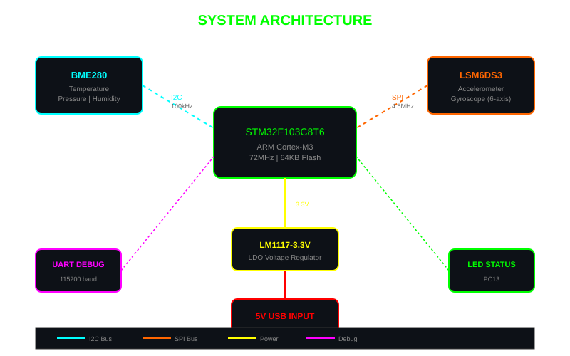
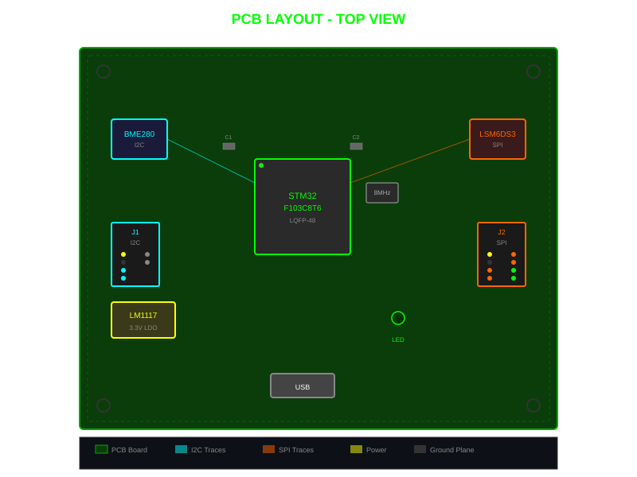
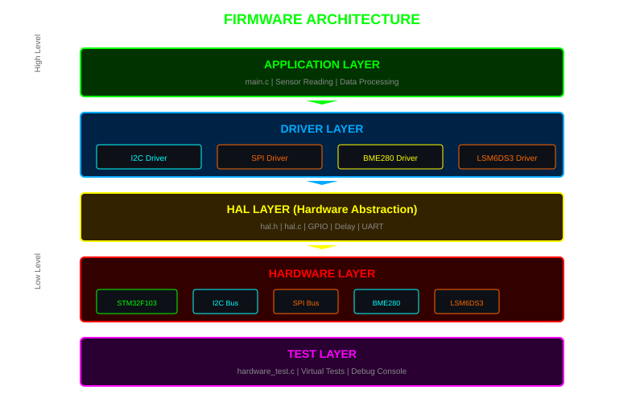
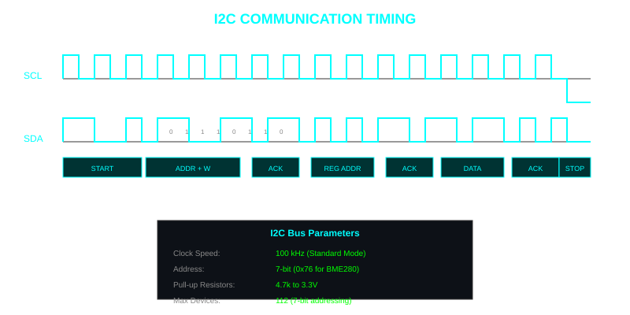
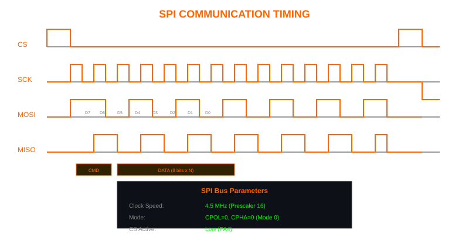
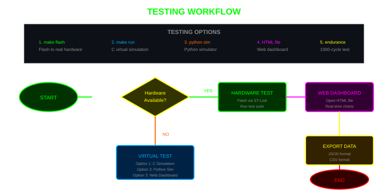
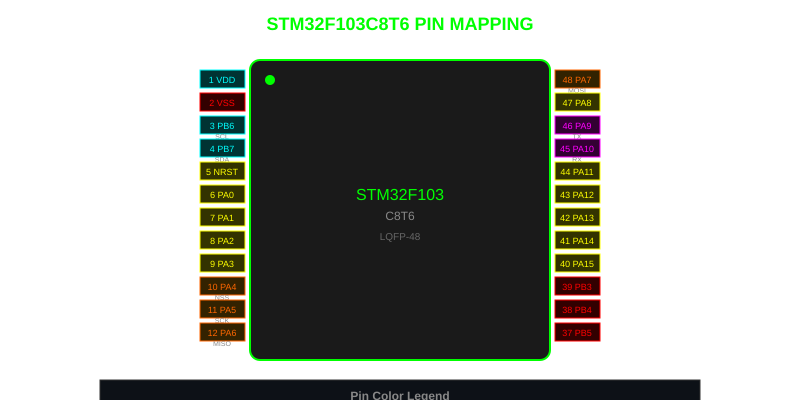

# Embedded PCB System - Sensor Interface Board

Custom PCB-based embedded system for multi-sensor data acquisition using I2C and SPI communication protocols.


---

## Table of Contents

- [Overview](#overview)
- [Features](#features)
- [Hardware](#hardware)
- [PCB Design](#pcb-design)
- [Firmware](#firmware)
- [Virtual Testing](#virtual-testing)
- [Web Dashboard](#web-dashboard)
- [How It Works](#how-it-works)
- [Getting Started](#getting-started)
- [Testing Options](#testing-options)
- [Pin Mapping](#pin-mapping)
- [Bill of Materials](#bill-of-materials)
- [Performance Metrics](#performance-metrics)
- [FAQ](#faq)
- [Troubleshooting](#troubleshooting)
- [Contributing](#contributing)
- [Changelog](#changelog)
- [Roadmap](#roadmap)
- [References](#references)
- [Tools Used](#tools-used)
- [License](#license)
- [Author](#author)
- [Acknowledgments](#acknowledgments)

---

## Overview

This project implements a custom-designed PCB for interfacing with multiple sensors via I2C and SPI communication protocols. The system uses an STM32F103C8T6 microcontroller (Blue Pill compatible) as the main processing unit.

**Key Capabilities:**
- Real-time temperature, pressure, and humidity monitoring (BME280 via I2C)
- 6-axis motion tracking - accelerometer + gyroscope (LSM6DS3 via SPI)
- Virtual testing environment for PC-based simulation
- Web-based dashboard for real-time visualization
- Complete hardware test suite for bring-up verification

---

## Features

| Feature | Description |
|---------|-------------|
| **I2C Communication** | 100kHz bus with BME280 sensor at address 0x76 |
| **SPI Communication** | 4.5MHz bus with LSM6DS3 IMU (Mode 0) |
| **Virtual Simulation** | PC-based testing without hardware |
| **Web Dashboard** | Real-time sensor monitoring with charts |
| **Protocol Analyzer** | I2C/SPI traffic viewer |
| **Register Dump** | View all sensor registers |
| **Alarm System** | Configurable threshold alerts |
| **Data Export** | JSON and CSV formats |
| **Fault Injection** | Simulate I2C/SPI errors |
| **Multiple Modes** | Normal, Stress, Drift, Random Walk |

---

## Hardware

### System Architecture



### PCB Specifications

| Parameter | Value |
|-----------|-------|
| Board Size | 160mm x 120mm |
| Layers | 2 (F.Cu, B.Cu) |
| Track Width | 0.25mm (signal), 0.5mm (power) |
| Via Size | 0.6mm diameter, 0.3mm drill |
| Clearance | 0.2mm |
| Copper Weight | 1 oz |
| Finish | HASL |

---

## PCB Design



Designed in KiCad with the following components:

### Schematic

```
                    +3.3V
                     |
                     |
            +--------+--------+
            |                 |
           [R1]             [R2]
          4.7k              4.7k
            |                 |
            |    +-------+   |
            +----+ PB6   +---+---- SCL
            |    |       |   |
            +----+ PB7   +---+---- SDA
                 |       |
                 | STM32 |
                 | F103  |
                 | C8T6  |
                 +---+---+
                     |
            +--------+--------+
            |        |        |
           PA4      PA5      PA7
           NSS      SCK     MOSI
            |        |        |
            +---+----+----+---+
                |         |
                |    +----+----+
                |    |         |
                +----+ LSM6DS3 |
                     |         |
                     +---------+

    BME280                LM1117-3.3
    +--------+            +--------+
    | VDD +--+---+3.3V    | IN  +--+---+5V
    | SDA +--+---+PB7     | OUT +--+---+3.3V
    | SCL +--+---+PB6     | GND +--+---+GND
    | GND +--+---+GND     +--------+
    +--------+
```

### KiCad Files

```
kicad/
├── embedded-pcb-system.kicad_pro    # Project file
├── embedded-pcb-system.kicad_sch    # Schematic
└── embedded-pcb-system.kicad_pcb    # PCB layout
```

---

## Firmware



### Project Structure

```
firmware/
├── include/
│   ├── hal.h              # Hardware Abstraction Layer
│   └── debug.h            # Debug UART interface
├── drivers/
│   ├── i2c_driver.h/c     # I2C communication driver
│   ├── spi_driver.h/c     # SPI communication driver
│   ├── bme280.h/c         # BME280 sensor driver
│   └── lsm6ds3.h/c        # LSM6DS3 IMU driver
├── src/
│   ├── hal.c              # HAL implementation
│   ├── main.c             # Main application
│   └── debug.c            # Debug console (115200 baud)
├── tests/
│   ├── hardware_test.h/c  # Hardware test suite
│   └── test_main.c        # Test runner
├── virtual/               # PC simulation
│   ├── virtual_hal.h/c    # Mock HAL layer
│   ├── i2c_driver.h/c     # Simulated I2C
│   ├── spi_driver.h/c     # Simulated SPI
│   ├── virtual_test.c     # PC test runner
│   ├── sensor_simulator.py # Python simulator
│   └── Makefile
└── Makefile               # ARM build system
```

### Main Application Flow

```
┌─────────────┐
│   START     │
└──────┬──────┘
       │
       ▼
┌─────────────┐
│ System Init │
│ (Clock,GPI) │
└──────┬──────┘
       │
       ▼
┌─────────────┐
│ I2C Init    │
│ (100kHz)    │
└──────┬──────┘
       │
       ▼
┌─────────────┐
│ SPI Init    │
│ (Mode 0)    │
└──────┬──────┘
       │
       ▼
┌─────────────┐
│ BME280 Init │
│ (0x76)      │
└──────┬──────┘
       │
       ▼
┌─────────────┐
│ LSM6DS3 Init│
│ (WHO_AM_I)  │
└──────┬──────┘
       │
       ▼
┌─────────────┐
│   LOOP      │
│ Read Sensors│
│ Process Data│
│ Update LED  │
│ Delay 500ms │
└─────────────┘
```

---

## Virtual Testing

### Option 1: C Simulation

```bash
cd embedded-pcb-system/firmware/virtual
make all
make run          # 10-second simulation
make endurance    # 1000-cycle test
```

### Option 2: Python Simulator

```bash
cd embedded-pcb-system/firmware/virtual
python sensor_simulator.py 30    # Run for 30 seconds
```

### Option 3: Web Dashboard

```bash
# Just open in browser
embedded-pcb-system/virtual-dashboard.html
```

---

## Web Dashboard

### Features

| Tab | Description |
|-----|-------------|
| **SENSORS** | Live charts for BME280 + LSM6DS3 data |
| **PROTOCOL ANALYZER** | I2C/SPI traffic viewer with statistics |
| **PIN STATES** | GPIO pin state visualization |
| **REGISTER DUMP** | View all sensor registers |
| **ALARMS** | Configurable threshold alerts |
| **SIM CONFIG** | Simulation mode, base values, fault injection |
| **SYSTEM** | MCU, sensor, PCB specifications |

### Controls

| Button | Action |
|--------|--------|
| STOP/START | Pause/resume simulation |
| RESET | Clear all data |
| EXPORT JSON | Download sensor data as JSON |
| EXPORT CSV | Download sensor data as CSV |
| RATE | Change update rate (1-20 Hz) |

### Simulation Modes

| Mode | Description |
|------|-------------|
| **NORMAL** | Realistic sensor simulation with noise |
| **STRESS TEST** | High noise, rapid changes |
| **FAULT INJECT** | Random 999C spike errors |
| **SENSOR DRIFT** | Gradual value drift over time |
| **RANDOM WALK** | Brownian motion simulation |

### Alarm Thresholds

| Setting | Default | Range |
|---------|---------|-------|
| Temp High | 30.0 C | 0-80 C |
| Temp Low | 15.0 C | -40-30 C |
| Humidity High | 80.0% | 0-100% |
| Humidity Low | 20.0% | 0-100% |
| Pressure Deviation | 50.0 Pa | 10-200 Pa |

---

## How It Works

### 1. I2C Communication (BME280)



```
Master (STM32)                    Slave (BME280)
     |                                  |
     |-------- START ----------------->|
     |-------- Address (0x76) -------->|
     |<------- ACK --------------------|
     |-------- Register (0xF4) ------->|
     |<------- ACK --------------------|
     |-------- Data (0xB7) ----------->|
     |<------- ACK --------------------|
     |-------- STOP ------------------>|
```

### 2. SPI Communication (LSM6DS3)



```
Master (STM32)                    Slave (LSM6DS3)
     |                                  |
     |-------- CS LOW ---------------->|
     |-------- Command (0x80|Reg) ---->|
     |<------- Data ------------------|
     |-------- 0x00 (dummy) --------->|
     |<------- Data ------------------|
     |-------- CS HIGH -------------->|
```

### 3. Sensor Data Processing

```
Raw Sensor Data
      │
      ▼
┌─────────────┐
│ Compensation │  (Temperature, Pressure, Humidity)
│ Algorithm    │  (Factory calibration coefficients)
└──────┬──────┘
       │
       ▼
┌─────────────┐
│ Unit Convert │  (C, Pa, %, mg, dps)
└──────┬──────┘
       │
       ▼
┌─────────────┐
│ Derived Data │  (Altitude, Pitch, Roll, Dew Point)
└──────┬──────┘
       │
       ▼
┌─────────────┐
│ Display/Log  │  (Dashboard, UART, JSON/CSV)
└─────────────┘
```

---

## Getting Started



### Prerequisites

```bash
# ARM Toolchain (for firmware)
# Windows: https://developer.arm.com/tools-and-software/open-source-software/developer-tools/gnu-toolchain/gnu-rm
# Linux: sudo apt install gcc-arm-none-eabi

# Python (for simulator)
# Download: https://www.python.org/downloads/

# KiCad (for PCB design)
# Download: https://www.kicad.org/download/
```

### Build Firmware

```bash
cd embedded-pcb-system/firmware
make all          # Build for STM32
make test         # Build test suite
make flash        # Flash via ST-Link
```

### Run Virtual Tests

```bash
cd embedded-pcb-system/firmware/virtual
make all
make run          # C simulation
make python       # Python simulator
```

### Open Web Dashboard

```bash
# Double-click file or:
start virtual-dashboard.html
# Open in Chrome/Firefox/Edge
```

---

## Testing Options

### 1. Hardware Testing (Real PCB)

```bash
make flash
# Connect ST-Link debugger
# Open serial terminal (115200 baud)
# Run test suite
```

### 2. Virtual Testing (PC Simulation)

```bash
cd firmware/virtual
make run
# See simulated sensor data in terminal
```

### 3. Web Dashboard (Browser)

```bash
# Open virtual-dashboard.html
# Real-time charts and controls
# Export data as JSON/CSV
```

### 4. Python Simulator

```bash
cd firmware/virtual
python sensor_simulator.py 60
# Colored terminal output
# Auto-export to sensor_data.json
```

---

## Pin Mapping



### I2C1 (BME280)

| STM32 Pin | Function | Connection |
|-----------|----------|------------|
| PB6 | SCL | BME280 SCL (4.7k pull-up) |
| PB7 | SDA | BME280 SDA (4.7k pull-up) |

### SPI1 (LSM6DS3)

| STM32 Pin | Function | Connection |
|-----------|----------|------------|
| PA4 | NSS | LSM6DS3 CS (Active Low) |
| PA5 | SCK | LSM6DS3 SCL |
| PA6 | MISO | LSM6DS3 SDO |
| PA7 | MOSI | LSM6DS3 SDA/SDI |

### Debug UART

| STM32 Pin | Function | Connection |
|-----------|----------|------------|
| PA9 | TX | USB-UART RX |
| PA10 | RX | USB-UART TX |

---

## Bill of Materials

| Ref | Component | Package | Quantity | Cost |
|-----|-----------|---------|----------|------|
| U1 | STM32F103C8T6 | LQFP-48 | 1 | $2.50 |
| U2 | BME280 | SMD | 1 | $3.00 |
| U3 | LSM6DS3TR | LGA-12 | 1 | $2.50 |
| U4 | LM1117-3.3 | SOT-223 | 1 | $0.50 |
| J1 | Pin Header 1x6 | 2.54mm | 1 | $0.10 |
| J2 | Pin Header 1x8 | 2.54mm | 1 | $0.10 |
| R1-R2 | Resistor 4.7k | 0603 | 2 | $0.02 |
| C1-C3 | Capacitor 100nF | 0603 | 3 | $0.03 |
| C4-C5 | Capacitor 10uF | 0805 | 2 | $0.04 |
| Y1 | Crystal 8MHz | HC-49S | 1 | $0.20 |
| LED1 | LED Green | 0805 | 1 | $0.01 |
| **Total** | | | **15** | **$9.00** |

---

## Tools Used

| Tool | Purpose | Version |
|------|---------|---------|
| **KiCad** | PCB schematic and layout | 7.0+ |
| **Embedded C** | Firmware development | C99 |
| **ARM GCC** | Cross-compilation toolchain | 12.2 |
| **ST-Link** | On-chip debugging and flashing | V2 |
| **Python** | Virtual simulation | 3.12 |
| **VS Code** | Code editor | Latest |
| **Git** | Version control | Latest |

---

## Performance Metrics

| Metric | Value |
|--------|-------|
| **Sampling Rate** | 10 Hz (configurable 1-20 Hz) |
| **I2C Clock** | 100 kHz (Standard Mode) |
| **SPI Clock** | 4.5 MHz |
| **Temperature Accuracy** | +/- 1.0 C |
| **Pressure Accuracy** | +/- 1 hPa |
| **Humidity Accuracy** | +/- 3% |
| **Accelerometer Range** | +/- 2/4/8/16 g |
| **Gyroscope Range** | +/- 245/500/1000/2000 dps |
| **Boot Time** | < 1 second |
| **Power Consumption** | ~20 mA active |
| **Data Latency** | < 10 ms |

---

## FAQ

### General Questions

**Q: What is this project?**
A: A custom PCB-based embedded system for multi-sensor data acquisition using I2C and SPI communication protocols.

**Q: What sensors are used?**
A: BME280 (temperature/pressure/humidity via I2C) and LSM6DS3 (6-axis IMU via SPI).

**Q: What microcontroller is used?**
A: STM32F103C8T6 (ARM Cortex-M3, 72MHz, 64KB Flash, 20KB SRAM).

**Q: Can I use this without hardware?**
A: Yes! Use the virtual testing environment with Python simulator or web dashboard.

### Technical Questions

**Q: How do I change the I2C address?**
A: The BME280 address is 0x76 (SDO=0) or 0x77 (SDO=1). Modify `BME280_I2C_ADDR` in the driver.

**Q: How do I change the SPI speed?**
A: Modify the prescaler in `spi_driver_init()`. Options: DIV2 to DIV128.

**Q: Can I add more sensors?**
A: Yes! Use the I2C header (J1) or SPI header (J2) to connect additional sensors.

**Q: How do I enable debug output?**
A: Connect a USB-UART adapter to PA9 (TX) and open a terminal at 115200 baud.

### Virtual Testing Questions

**Q: How do I run the simulation?**
A: `cd firmware/virtual && make run` or open `virtual-dashboard.html` in a browser.

**Q: Can I export data?**
A: Yes! Use the EXPORT JSON or EXPORT CSV buttons in the web dashboard.

**Q: How do I simulate faults?**
A: Go to SIM CONFIG tab and enable fault injection checkboxes.

---

## Troubleshooting

### Hardware Issues

| Problem | Possible Cause | Solution |
|---------|---------------|----------|
| MCU won't start | Missing BOOT0 pulldown | Add 10k resistor to GND |
| No I2C response | Missing pull-ups | Add 4.7k resistors on SCL/SDA |
| SPI data corruption | Clock too high | Reduce prescaler to DIV32 |
| BME280 returns 0xFF | Wrong address | Try 0x76 or 0x77 |
| LSM6DS3 returns 0x00 | CS not toggling | Check PA4 connection |
| LED not blinking | Wrong pin config | Verify PC13 connection |
| No serial output | Baud rate mismatch | Use 115200 baud |
| Power supply noise | Missing capacitors | Add 100nF decoupling caps |

### Software Issues

| Problem | Possible Cause | Solution |
|---------|---------------|----------|
| Build fails | Missing toolchain | Install arm-none-eabi-gcc |
| Flash fails | ST-Link not connected | Check SWD connections |
| Simulation crashes | Wrong make target | Run `make clean && make all` |
| Dashboard not working | Browser compatibility | Use Chrome/Firefox/Edge |
| Data not exporting | File permission | Check download folder |
| High CPU usage | Update rate too fast | Increase interval to 200ms+ |

### Debug Commands

```bash
# Check I2C devices
i2cdetect -y 1

# Read BME280 register
i2cget -y 1 0x76 0xD0

# Read LSM6DS3 WHO_AM_I
spi-pipe -D /dev/spidev0.0 -s 1000000 -b 8 -l LSB -m 1 -H 1 -C 0 -r 1 0x8F | hexdump

# Monitor serial output
screen /dev/ttyUSB0 115200

# Flash firmware
st-flash write firmware.bin 0x08000000

# Run GDB debug
arm-none-eabi-gdb firmware.elf -ex "target remote :3333"
```

---

## Contributing

Contributions are welcome! Please follow these steps:

1. Fork the repository
2. Create a feature branch (`git checkout -b feature/amazing-feature`)
3. Commit your changes (`git commit -m 'Add amazing feature'`)
4. Push to the branch (`git push origin feature/amazing-feature`)
5. Open a Pull Request

### Development Guidelines

- Follow existing code style
- Add comments for complex logic
- Update documentation for new features
- Test on hardware before submitting
- Keep commits focused and atomic

### Code Style

```c
// Use descriptive variable names
uint8_t sensor_address = 0x76;

// Add function headers
/**
 * @brief Initialize BME280 sensor
 * @param hi2c I2C handle pointer
 * @param addr Sensor I2C address
 * @return 0 on success, error code otherwise
 */
uint8_t bme280_init(bme280_handle_t *hbme, i2c_handle_t *hi2c, uint8_t addr);

// Use meaningful comments
// Read temperature compensation coefficients from NVM
```

---

## Changelog

### v1.0.0 (2026-09-10)
- Initial release
- KiCad PCB design
- STM32F103 firmware
- BME280 I2C driver
- LSM6DS3 SPI driver
- Hardware test suite
- Virtual testing environment
- Web dashboard

### v1.1.0 (Planned)
- [ ] Add more sensor drivers
- [ ] RTOS support
- [ ] WiFi/Bluetooth connectivity
- [ ] Mobile app
- [ ] Cloud data logging
- [ ] Battery management
- [ ] Low power modes

---

## Roadmap

### Phase 1: Core (Complete)
- [x] PCB design and fabrication
- [x] Basic firmware structure
- [x] I2C driver
- [x] SPI driver
- [x] BME280 driver
- [x] LSM6DS3 driver

### Phase 2: Testing (Complete)
- [x] Hardware test suite
- [x] Virtual simulation
- [x] Web dashboard
- [x] Protocol analyzer
- [x] Data export

### Phase 3: Enhancement (In Progress)
- [ ] More sensor support
- [ ] Data logging to SD card
- [ ] Wireless connectivity
- [ ] Mobile application
- [ ] Cloud integration

### Phase 4: Production (Future)
- [ ] Enclosure design
- [ ] Manufacturing setup
- [ ] Quality testing
- [ ] Documentation
- [ ] Support portal

---

## References

### Datasheets
- [STM32F103C8T6 Datasheet](https://www.st.com/resource/en/datasheet/stm32f103c8.pdf)
- [BME280 Datasheet](https://www.bosch-sensortec.com/media/boschsensortec/downloads/datasheets/bst-bme280-ds002.pdf)
- [LSM6DS3 Datasheet](https://www.st.com/resource/en/datasheet/lsm6ds3.pdf)
- [LM1117 Datasheet](https://www.ti.com/lit/ds/symlink/lm1117.pdf)

### Application Notes
- [AN2581: STM32 I2C Programming](https://www.st.com/resource/en/application_note/an2581.pdf)
- [AN3169: SPI Communication with STM32](https://www.st.com/resource/en/application_note/an3169.pdf)
- [AN4235: LSM6DS3 Usage](https://www.st.com/resource/en/application_note/an4235.pdf)

### Tools
- [KiCad Documentation](https://docs.kicad.org/)
- [ARM GCC Toolchain](https://developer.arm.com/tools-and-software/open-source-software/developer-tools/gnu-toolchain/gnu-rm)
- [STM32CubeProgrammer](https://www.st.com/en/development-tools/stm32cubeprog.html)
- [OpenOCD](https://openocd.org/)

### Community
- [STM32 Community](https://community.st.com/)
- [KiCad Forum](https://forum.kicad.info/)
- [Embedded Systems Discord](https://discord.gg/embedded-systems)

---

## License

This project is licensed under the MIT License - see the [LICENSE](LICENSE) file for details.

```
MIT License

Copyright (c) 2026 SIH Hackathon Project - augsatr

Permission is hereby granted, free of charge, to any person obtaining a copy
of this software and associated documentation files (the "Software"), to deal
in the Software without restriction, including without limitation the rights
to use, copy, modify, merge, publish, distribute, sublicense, and/or sell
copies of the Software, and to permit persons to whom the Software is
furnished to do so, subject to the following conditions:

The above copyright notice and this permission notice shall be included in all
copies or substantial portions of the Software.

THE SOFTWARE IS PROVIDED "AS IS", WITHOUT WARRANTY OF ANY KIND, EXPRESS OR
IMPLIED, INCLUDING BUT NOT LIMITED TO THE WARRANTIES OF MERCHANTABILITY,
FITNESS FOR A PARTICULAR PURPOSE AND NONINFRINGEMENT. IN NO EVENT SHALL THE
AUTHORS OR COPYRIGHT HOLDERS BE LIABLE FOR ANY CLAIM, DAMAGES OR OTHER
LIABILITY, WHETHER IN AN ACTION OF CONTRACT, TORT OR OTHERWISE, ARISING FROM,
OUT OF OR IN CONNECTION WITH THE SOFTWARE OR THE USE OR OTHER DEALINGS IN THE
SOFTWARE.
```

---

## Author

**augsatr** - [GitHub](https://github.com/augsatr)

[](https://github.com/augsatr)

---

## Acknowledgments

- STMicroelectronics for STM32 and LSM6DS3 documentation
- Bosch Sensortec for BME280 datasheet
- KiCad team for open-source PCB design tools
- ARM for Cortex-M3 toolchain
- All contributors and supporters

---

## Star History

[](https://star-history.com/#augsatr/embedded-pcb-system&Date)

---

## Support

If you find this project helpful, please give it a star on GitHub!

For issues and questions, please open an issue on the [GitHub Issues](https://github.com/augsatr/embedded-pcb-system/issues) page.
